<h1 align="center">Hi, I'm Erik — <code>BachErik</code> 👋</h1>

  Backend-leaning builder • Kubernetes enjoyer • NixOS tinkerer • Minecraft modder • Learning Go

  
  
  

## 🧠 About me

I’m **Erik** (online: **BachErik**) — I like systems that are **reproducible**, **well-documented**, and **actually deployable**.

- Mostly **backend + infrastructure** (UI only when it earns its keep).
- I build **Kubernetes-native** things and care about **clean boundaries** and **good docs**.
- I **daily-drive NixOS** (and I’m Arch-familiar).
- I occasionally disappear into the mines to build **Minecraft mods & tooling**.

## 🔭 Current focus

- **Kunamel** — Kubernetes-native game panel concept: **extensions + per-user resource limits + clean API boundaries**
- **Go** for backend + extension implementations (and aggressively questioning every interface)
- **Minecraft (Java / Fabric)** modding & server automation workflows

## 🧰 Toolbox

**Languages**  
Java • Go (learning) • Python (a bit) • TypeScript/JavaScript

**Infra & Ops**  
Kubernetes • Docker/containers • Git/GitHub • Linux (NixOS + Arch familiarity)

**Editor / Workflow**  
IntelliJ IDEA (Java) • VS Code (everything else)

## 🧪 Featured work

- [**Kunamel**](https://github.com/Kunamel/) — **Ku**bernetes **na**tive ga**me** pane**l**
- [**LyreWorks**](https://github.com/LyreWorks/) — Music/audio projects & tooling
- [**BachFlow**](https://github.com/BachFlow/) — Status page + monitoring experiments
- [**KilledBy**](https://github.com/BachErik/killedby) — A customizable reimplementation of killedby.tech:
  add companies, tweak entries, add projects, and customize the footer.

## 🤝 Connect

  
  
  
  
  

